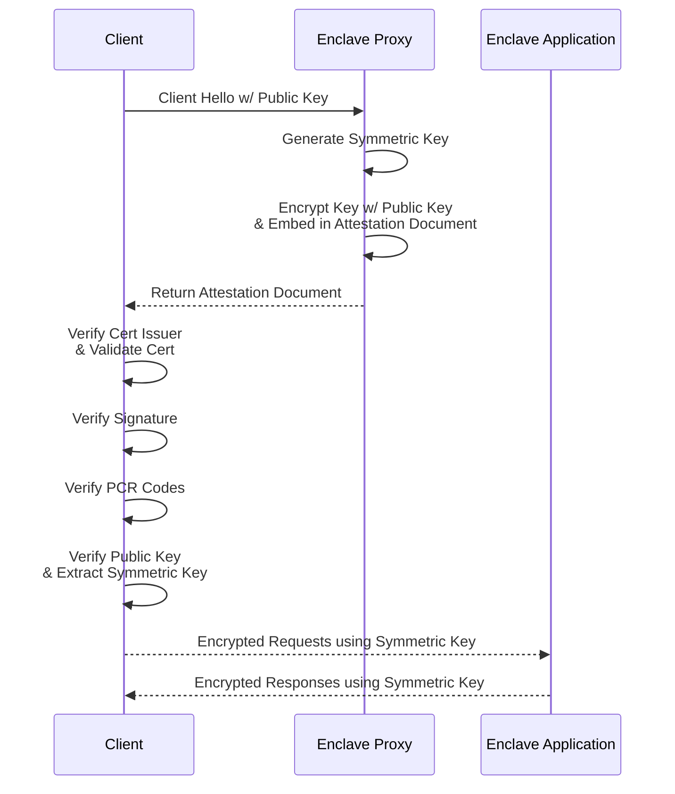

# Workshop 1: Enclave Fundamentals 

 

_Workshop Length Estimate:_ 30-60 minutes.

In this workshop, we'll cover:

* What are secure enclaves?
* What types of enclaves are there? 
* How do we write software to deploy to an enclave?
  * How to manage access control.
  * How to allowlist outbound connections.
  * How to make enclaves configureable (without effecting their attestation).
* How do we configure and deploy a secure enclave?
* How can we securely connect to an enclave?
  
Workshop resources:
1. Source Code: [https://github.com/oblivious-demo/oblv-fastapi](https://github.com/oblivious-demo/oblv-fastapi)
2. Google Collab: [to complete]
3. A public/private key pair for Alice & Bob: In this folder to keep the workshop timely and repeatable 🙂
4. YouTube Walk Through: [https://youtu.be/JEdls9tKMjk](https://youtu.be/JEdls9tKMjk)
  
### What are secure enclaves?
  
Secure enclaves are isolated servers with two very powerful properties:

- They have extremely limitted IO and need explicit inbound and outbound connections to recieve and send data. No one can simply SSH into an enclave and see data as it is being processed, nor can data end up unexpectedly in log files. 
- The underlying infrastructure "attests" what is running inside. So when we write some software to deploy into an enclave, the physical infrastructure will hash the software and environment and place these values into a document which it digitally signs. In short, the cloud infrastructure implicitly gaurentees to those connecting to the enclave the exact processing and behaviour of what is running inside the enclave.

This is extremely powerful as we can use these charecteristics to clearly structure rules around what processes can decrypt what data (not what servers, or people - what actual computation is approved!). AS you can imagine, all of the major cloud providers have developed an enclave offering of one form or another (AWS, Azure, GPC, Alibaba Cloud, IBM, Oracle, OVH Cloud.... the list goes on) over the past few years and billions worth of investments have been poored into the domain.
  
### What types of enclaves are there? 
  
Originally, enclaves were silicon based. Intel's SGX litterally seperated out the silicon that processed the enclave functionality from the main CPU. However, because of this the memory within the enclave was very limitted reducing its wide spread applicability. There have been a number of developments though in recent years that mitigate some of the challenges with this. In particular, the memory footprint of enclave applications were expanded by encrypting more memory for the enclave to use. Naive implementations of this leak a huge amount of information about what was running in the enclave such as the patterns of how the enclave accessed the memory. Approaches such as Oblivious RAM (ORAM) endeavour to hide such access patterns, but come with a performance overhead.

An approach that came later and appears to be more widely addopted lately, are virtual machine (VM) based enclaves. Today, when you use your cloud you may be sharing the same physical infrastructure as Netflix for example. However, you can't actually see what Netflix users are doing. This is because the cloud provider uses a hypervisor to seperate CPUs and RAM between tenants of the servers. This technology is one of the backbones of cloud computing and has been critical to the success of companies like AWS and GPC (amoungst others).

At first it may seem like pure hardware based enclaves are in some way better and this is a topical debate. But realistically, if a physicist has physical access to a chip the will very likely have _some_ ability to measure the current passing through the device. While this is an extreme example, we intend it only to illustrate that there is always some trust placed on the cloud provider whenever you use secure enclaves. 

With every PET, their is usually some burden of trust required - on the protocol developers, on the peer review of the cryptography used, on the implementation, on the security testing. In choosing a PET, it is worth asking yourself what trust relationships are you comfortable with as it may save you a lot of time and energy in the long game. 

### How do we securely connect to an enclave? 
  
Most enclaves are integrated with the clouds key management services by default. This is great for governance applications, but not if you would like to use the enclave to broker turst in the context of multiparty computation.

To achieve this, we instead need to integrate the attestation document of the secure enclave in creating a secure connection. That is exactly what we have done with the `oblv` cli proxy. It works as follows:
 

In the above handshake, the user authenticates themselves with a public key which was placed into the enclave at build time. The enclave creates a unique session symetric key for AES encryption for each connection made. This is inturn encrypted with the public key recieved and embedded as an additional arguemtn into the attestation document signed by the physical infrastructure. This document is returned to the client proxy, which allows the client to validate the enclave is running the intended source coude (confirming the PCR hashes), that the cert chain is valid and has not expired, that it is indeed the cloud provider who has signed the attestation document and of course that they can extract the symetric key returned.

Once the client and the enclave have established a shared encryption key, the payload and path parameters of the enclave are encrypted and decrypted from the client to the enclave. This means you can send data without trusting the account holder who is hosting the secure enclave as the keys were generated inside the enclave itself. 
 
⚠️ **Note**: *Another option would be to run TLS PSK (pre-shared keys) instead of payload encryption. However, in doing so you become limitted in terms of the web application firewalls (WAF) you can use and you maybe subjected to DOS attacks of various forms.*

  
### How do we write software to deploy to an enclave?
  
For this we will be talking through the workshop resource [Source Code](https://github.com/oblivious-demo/oblv-fastapi). 
This repository uses Pythons FastAPI framework to demonstrates:
  * How to manage access control.
  * How to allowlist outbound connections.
  * How to make enclaves configureable (without effecting their attestation).
  * Writing unit tests locally.
  
### How do we configure and deploy a secure enclave?

Perhaps the easiest way to see how an enclave can be configured and deployed is by watching an example. The YouTube walk through from the workshop resources does just this. Tap the video below to skip to the point where we configure and lauch the enclave service:
 

  
### How can we securely connect to an enclave?
  
The final step is to connect to the enclave from a computer or server. To do so, we will leverage the light-weight `oblv` cli proxy from Oblivious. 
We have provided the [Google Collab]() from the workshop resources to step you through connecting to and interacting with an enclave. To make this as easy as possible, we've kept the public/private key pairs of two parties (Alice & Bob) as part of the workshop resources.
