# Workshop 2: Synthetic Data from Multiple Private Data Sources


<sup>_Workshop Length Estimate:_ 30 minutes.<sup>

In this workshop, we'll cover:

* What are secure enclaves? (Recap)
* What is Differential Privacy? 
* What is Synthetic Data?
* Putting it all together:
  * Basic functionality of the enclave.
  * Caveats and validators.
  * Reusability.
  * A Practical Implementation.
* How do we configure and deploy the secure enclave?
* How can we securely connect to an enclave and generate DP Synthetic Data from Private Data Sources?
  
Workshop resources:
1. Source Code: [https://github.com/oblivious-demo/oblv-smartnoise-synth](https://github.com/oblivious-demo/oblv-smartnoise-synth)
2. Google Collab: [](https://colab.research.google.com/github/ObliviousAI/enclave_workshops/blob/master/workshops/2_Synthetic_Data_from_Multiple_Private_Data_Sources/Workshop_2_Synthetic_Data_from_Multiple_Private_Data_Sources.ipynb)
3. A public/private key pair for Alice & Bob: In this folder to keep the workshop timely and repeatable 🙂
4. YouTube Walk Through: (coming soon :raised_hands:)
  
### What are secure enclaves? (Recap from [Workshop 1](../1_Enclave_Fundamentals/README.md))
  
Secure enclaves are isolated servers with two very powerful properties:

- They have extremely limited IO and need explicit inbound and outbound connections to receive and send data. No one can simply SSH into an enclave and see data as it is being processed, nor can data end up unexpectedly in log files. 
- The underlying infrastructure "attests" what is running inside. So when we write some software to deploy into an enclave, the physical infrastructure will hash the software and environment and place these values into a document that it digitally signs. In short, the cloud infrastructure implicitly guarantees to those connecting to the enclave the exact processing and behaviour of what is running inside the enclave.

This is extremely powerful as we can use these characteristics to clearly structure rules around what processes can decrypt what data (not what servers or people - what actual computation is approved!). As you can imagine, all of the major cloud providers have developed an enclave offering of one form or another (AWS, Azure, GPC, Alibaba Cloud, IBM, Oracle, OVH Cloud.... the list goes on) over the past few years and billions worth of investments have been poured into the domain.
  
We can leverage secure enclaves to broker trust between multiple parties by guaranteeing what process will be applied to their respective sensitive data and the controls in place to protect the confidentiality of their data throughout its life cycle.
  
### What is Differential Privacy? 
  
While the focus of this workshop is on synthetic data, their are different approaches to create synthetic data. The only approach which gives a theoretical privacy gaurentee is called Differentially Private (DP) synthetic data.
  
Differential privacy, coined in [2006 by Cynthia Dwork, Frank McSherry, Kobbi Nissim and Adam D. Smith](https://link.springer.com/chapter/10.1007/11681878_14), is a theoretical statement about the geussing probability of data being present in a dataset given stochastic measurements/queries of the dataset (intuitively: any information gained that is derived from the dataset). Some processes may naturally create stochastic measurements however in most cases callibrated noise is intensionally applied to a result of a measurement such that the measurement will be differentially private. 
  
This framework of privacy ultimately relies on what you want the geussing probability to be and there is a natural tradeoof between accuracy of a measurement and the geussing probability. Strictly speaking this geussing probability is parameterized by a coefficient ε. If ε is 0, measurement discloses no information about the data being in the dataset and so the geussing probability is uniform (50:50). If ε is infinite, than the measurement discloses with absolute certainty whether the data is present or not in the dataset.

$$ \epsilon \geq \ln \left( \frac{Pr[M(x) \in S]}{Pr[M(x') \in S]} \right) $$
  
There is no golden rule in how you select an acceptable ε which you can deem "safe" and you will likely need to decide internally what you believe to be acceptable risk.
  
As a final note, the ε of multiple measurements/queries can interact in complicated ways. However, it is very easy to upper bound the worst case ε by the sum of all of the ε: $\epsilon = \sum_{i=0}^{n} \epsilon_i$

```mermaid
graph LR
    A[Dataset] --> B(Calculation)
    B --> C{Calibrated Noise}
    C -->|ε| D[Query 1]
    C -->|ε| E[Query 2]
    C -->|ε| F[Query 3]
    C --- |Recorded| G[Budget `Spent` = 3ε]
```
  

  
### What is Synthetic Data?

Synthetic Data (SD) is a broad set of approaches to taking a dataset and learning about its structure, such that new fake data can be created which appears similar to the original but which do not hold any of the original samples.

These approaches are classified as unsupervised machine learning models as they endeavour to model the input distribution of the data.

```mermaid
graph LR
    A[Dataset] --> B(Fit Model with DP=ε)
    B -->|zero additional cost| D[Samples from model #1]
    B -->|zero additional cost| E[Samples from model #2]
    B -->|zero additional cost| F[Samples from model #3]
    B --- |Recorded| G[Budget `Spent` = ε]

```


  
The big challenge here is around what modelling assumptions and constraints to use. Unfortunately, this information is not captured when samples are drawn, so we don’t know how realistic the samples drawn are, and no meaningful guarantees can be made about the conclusions drawn from them.

Nevertheless, DP SD can be extremely useful in sharing a non-sensitive dataset for the purpose of planning experiments, testing systems (prior to using production systems), gaining intuition and more. 

The challenge is that if 2 or more parties create synthetic data in isolation from one another, the model has no way to maintain any interactions between the data of each party. Imagine, for instance, one party had a list of ids and ages, and the second party had a list of ids and salaries. Well, if each party created synthetic data individually, we could generate realistic-looking ages and realistic salaries, but the relationships between salary and age would necessarily be lost before any future analysis could be performed.

The enclave endeavours to solve this challenge by creating a secure and isolated environment where both parties can upload their data, and a join can be performed within the enclave prior to synthetic data generation.

> :warning: **Synthetic Data**: Be careful not to make decisions based purely on synthetic data. GAN-based SD models have a tendency to miss modes, that is to say, that the data sampled looks real at an individual level, but when looking at a macro level, small clusters (potentially minorities) may be lost. For Copula-based SD, only marginal distributions of the data are used and similarly, some non-linear correlations may be lost. If anyone tells you they have solved this without a major loss in performance (eg Bayesian NN or equivalent), you’d expect them to have won an ICLR/NeurIPS/ICCV/etc paper of the year or something along those lines, as it would be a *big* contribution to the field.

> :bulb: **Sensitivity & Sensitive Data**:  Remember we spoke of guessing probabilities earlier? Well, our SD model typically won’t know how many times a record will appear after the join (ie if id=1 were to turn up multiple times, revealing more about record 1 than intended). This is often referred to as the “sensitivity” of the data, and we could use entity-based DP, but for simplicity, we will ignore this for now. As such, we will perform an inner join and confirm all ids are unique prior to joining the data together as a sanity check. 

### Putting it all together:

#### Basic functionality of the enclave


 
#### Caveats & Validators

There are essentially 3 levels of security applied in the system:
- The first is the load balancer and web application firewall. This will block things like connections coming from proxies, botnets, filters based on payload size, rate limiters, etc. Usually fairly simple rules; however, this is an important part of OWASP and other frameworks to prevent DOS attacks and other malicious brute-force attacks.
- The proxy runs inside the enclave, which manages user connections according to access control lists. It encrypts and decrypts traffic entering and leaving the enclave based on keys established through the attestation-based initial handshake.
- Application-based logic. The actual logic of how data is consumed is down to the designer of the MPC system. If you create an API handle that just hands all the sensitive data to whoever calls it, then the application won’t be particularly secure.  We will discuss more advanced protections you may want to consider in future, but they all follow standard secure coding practices. 

Of course, if you would like to be even more secure, you may want the enclave and clients to be connecting over a strict VPN or equivalent. 

#### Reusability

The last point worth weighing on is reusability. If we would like to run this as an allow-listed service in your infrastructure, you may want to build it with configurations stored in the `/usr/runtime.yaml`. For example, selecting the specific Smartnoise SynthData model, the parameters, the epsilon, etc. This is, of course, up to you, but it may make future reuse less painful from an administration perspective.

#### A Practical Implementation 

We have an example end-to-end application in the demo account [here]().

### How do we configure and deploy a secure enclave?

This will follow the same steps as [Workshop 1](../1_Enclave_Fundamentals/README.md) but update the paths to be simple

```
GET /config
POST /upload_csv
GET /generate
```
  
With a single role, let’s call it `data_provider` and fixed cardinality os `2`.  No outbound calls or build args are required.

### How can we securely connect to an enclave?
  
The final step is to connect to the enclave from a computer or server. To do so, we will leverage the light-weight `oblv` cli proxy from Oblivious. 
We have provided the [](https://colab.research.google.com/github/ObliviousAI/enclave_workshops/blob/master/workshops/1_Enclave_Fundamentals/Workshop_1_Enclave_Fundamentals.ipynb) from the workshop resources to step you through connecting to and interacting with an enclave. To make this as easy as possible, we've kept the public/private key pairs of two parties (Alice & Bob) as part of the workshop resources.
 
For you convenience, if you are rebuilding the service yourself using the public/private keys attached, their base64 encoded strings are as follows:
 
*Alice*:
 ```
MIIBCgKCAQEAsNooqfUM3YYBVwfoXp8zTyqdc7EAshRLQQPXeBVSie2L5BAuqnnZS9GiQmg8CiJnz5e+LVLNl9Xm+n9HO/bvWcBbMIh+LucqTgjDjenTH55pAuWMEfCcGMlZg5Kwsrwm4BMrB0oJbNGecRfLRwciIh8M8BtaUZYlrq5xFmSY0Ew1M0hPQZJx0AOwXVQMhZ5iU12JItxcK+MbWiikcpC3R3QBwdWfXkbchd33savOgHyVMcV4PNjkxLjH7d7ui5zjadWMSRvyq+EvY34ycBju+N1DGRqpiuVqU7uUiDPKRIOdC80BpgeE2tPULRlHCJIiVAakQneM2PIBAp4hR4DLrQIDAQAB
 ```
 
*Bob*:
 ```
MIIBCgKCAQEAwJ5+Lx51TgvQ+1vUyYpTQoSJKRyTiDN45DAeJWPk4QiCXnKmScQiOrArw2QQ2pvUyYA2NU7vScikXaZXyCjGW/HHvERWkjaPFJcWNapOjEoZsSCEJhEDle7VEYHJ3JFcH4C+HHNZ+5Z9If6yCraELN8QRjXwAe+vzHex9zsw5dhX+7CcvP59B1BpBzWFtPgJHu4gAi9SnIW1/Zi8WtdBYheZr5Vya6Sg4TptrPD5iFhfbGwCiMXcfPPY5lpi/WPynqge27GoGVcd7PTCJaYEYsHkGd+wBOiLCX6hr+Fr3nXEu6qmmMOoqAIZR45DihIhf5iVgaSBXqT/IfK21tqGjwIDAQAB
 ```
